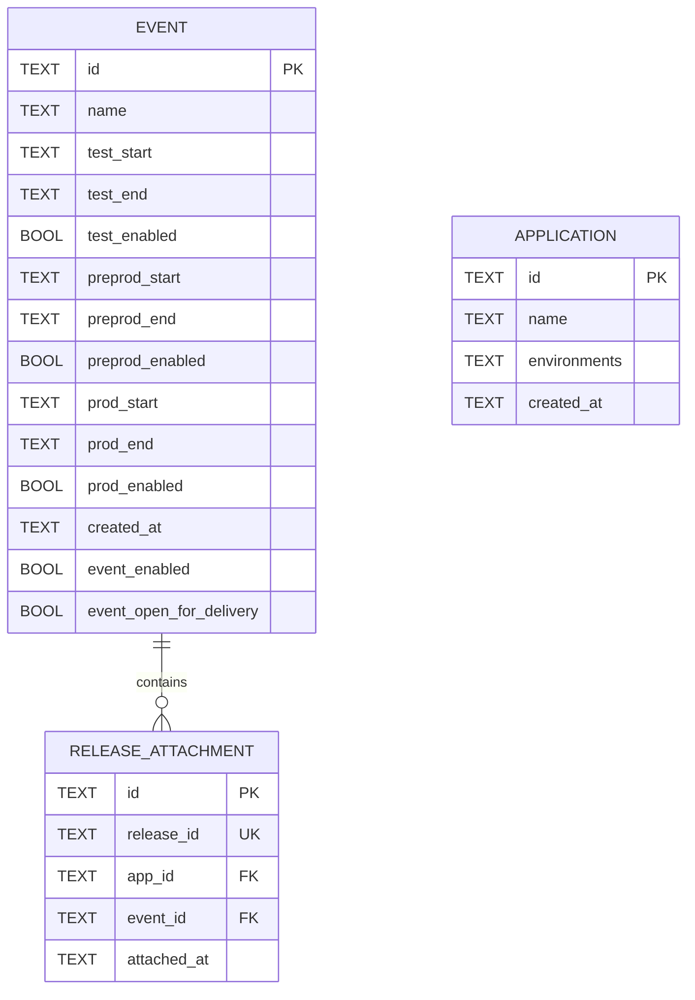

# Implementation Plan: Process Manager API

## Goal
The goal is to implement a process management system that allows Release Managers to define deployment windows for future events (TEST, PREPROD, PROD) and enables Development Teams to link specific software releases to these events. Additionally, it provides management of Applications and their valid jurisdictions per environment. The system will provide a validation mechanism to ensure releases are deployed within their designated time windows.

## Requirements

- **Event Management**: Full CRUD capabilities for Release Events including name and three distinct ISO-8601 UTC time windows.
- **Application Management**: Creation and retrieval of applications with defined jurisdictions per environment. Supported environments are `dev`, `test`, `preprod`, and `prod`. Supported jurisdictions are `APAC`, `CH`, `EMEA`, and `US`.
- **Release Linking**: Ability to associate a unique `releaseId` with an `eventId`.
- **Window Validation**: Logic to determine if a release (based on its timestamp) is valid for the current event phase.
- **REST Interface**: Implementation of endpoints: `/events/`, `/release/attach/`, `/release/validate/id`, and `/applications/`.
- **Persistence**: Reliable storage of events, applications, and attachments with referential integrity.

## Technical Considerations

### Database Schema Design

The existing schema must be updated to support the newly added `Application` entity. SQLite is currently being used.

- **Table Specifications**:
    - `EVENT`: Stores the master schedule. All timestamps are ISO-8601 UTC strings. Each phases ( test, preprod, prod can be enabled / disabled separately).
    - `RELEASE_ATTACHMENT`: Maps a release artifact to an event. `release_id` is indexed and unique.
    - `APPLICATION`: Stores application configurations. The `environments` column will store JSON text mapping environments (`dev`, `test`, `preprod`, `prod`) to valid jurisdictions (`APAC`, `CH`, `EMEA`, `US`, `GLOBAL`).

### Types Updates (src/types.ts)

Need to define zod schemas and types for applications:
- `EnvironmentSchema`: Enum or literal union for `dev`, `test`, `preprod`, `prod`.
- `JurisdictionSchema`: Enum or literal union for `APAC`, `CH`, `EMEA`, `US`, `GLOBAL`.
- `ApplicationSchema`: Schema for application object.
- `CreateApplicationSchema`: Schema for creating an application.

### Backend API Design (src/api/routes.ts)

Additional endpoints to implement:
- **POST `/applications/`**: Validate and create a new application, mapping environments to jurisdictions.
- **GET `/applications/`**: Fetch a list of all configured applications.

### Repositories (src/services/ApplicationRepository.ts)
- Create a new `ApplicationRepository` to handle SQLite interactions for the `APPLICATION` table.
- Needs methods: `createApplication` and `getApplications`.

### Frontend Updates (src/ui)
- Define Application interfaces in API client (`client.ts`).
- Add API client methods: `getApplications` and `createApplication`.
- Update `components/Providers.tsx` or `layout.tsx` to include an Application Dashboard link if needed.
- Build Application Management view:
  - Application List Table
  - Create Application Modal/Form with environment-to-jurisdictions selectors.

### Swagger & documentation update 

- udpate the swagger with the API specs 
- update the readme and curl examples.